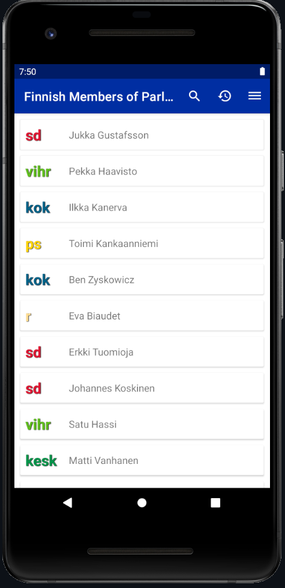

# parliament-app

## General

An application which allows one to browse through Finnish members of parliament and filter them based on parties or constituencies, as well as search members by name. The user can also add ratings and comments for each member.

## Misc

This project was done for an Android development course in [Metropolia UAS](https://www.metropolia.fi/en).
